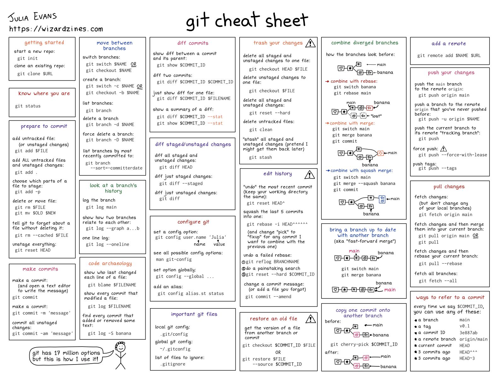
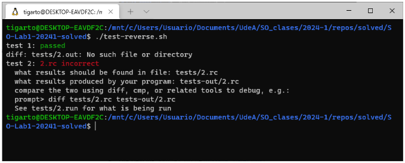

# Sesión 1 - Primeros pasos

**Fecha**: 26/08/2024

## Recursos disponibles

A continuación se muestran una lista de recursos disponibles.

## 1. Herramientas


### 1.1. Linux básico

En linux todo es un archivo (directorios, archivos como tal y dispositivos). En linux el sistema de archivos se organiza en una estructura jerárquica a modo de arbol, siendo el nivel más alto del sistema el directorio raíz (`/`) tal y como se muestra en la siguiente figura:


| Comando  | Descripción                                                                      |
| -------- | -------------------------------------------------------------------------------- |
| `whatis` | Muestra de manera resumida lo que hace un comando.                               |
| `man`    | Muestra el manual de comandos                                                    |
| `pwd`    | Imprime la ruta del directorio de trabajo actual                                 |
| `cd`     | Cambia el directorio de trabajo actual                                           |
| `ls`     | Lista los el contenido (archivos y directorios) del directorio de trabajo actual |
| `clear`  | Limpia pantalla                                                                  |
| `mkdir`  | Crea un nuevo directorio                                                         |
| `rmdir`  | Borrar directorio                                                                |
| `cp`     | Copia archivos y directorios                                                     |
| `rm`     | Borra archivos y directorios                                                     |
| `mv`     | Mueve o renombra archivos                                                        |

De todos los comandos, el manual (`man`) es muy importante, la siguiente imagen de [Julia Evans](https://x.com/b0rk) resume cómo usarlo:


También es bueno tener en cuenta que cuando se quiera navegar en consola, por medio del comando `cd`, a través del sistema de archivos recordar algunos los directorios especiales empleados en linux:

| Directorio | Descripción                                                                         |
| ---------- | ----------------------------------------------------------------------------------- |
| `/`        | Directorio raíz                                                                     |
| `.`/       | Directorio actual                                                                   |
| `..`/      | Directorio padre del directorio actual (directorio en el cual me encuentro ubicado) |

#### Material de apoyo

> 1. **Linux básico** (material del curso) [[link]](https://udea-so.github.io/udea-so/docs/laboratorio/tutoriales/herramientas/linux)
> 2. **Working with Bash** (MIT) [[link]](https://www.mit.edu/~amidi/teaching/data-science-tools/study-guide/engineering-productivity-tips/#working-with-bash)
> 3. **The Unix and GNU/Linux command line** (Free Electrons) [[link]](unix_linux_introduction.pdf)

#### Reference sheet

> **GNU/Linux most wanted** [[link]](command_memento.pdf)

## 2. Compilador `gcc`

Para la práctica con tener claro los siguientes comandos basta:

1. Generación del ejecutable:
   
   ```
   gcc archivoFuente –o nombreEjecutable -Wall
   ```
   
2. Corriendo el ejecutable:
   
   ```
   ./nombreEjecutable
   ```

Por ejemplo, suponiendo que se tiene un archivo fuente con el siguiente llamado [`hola_mundo.c`](hola_mundo.c):

```c
#include <stdio.h>

int main() {
  printf("Hola mundo\n");
  return 0;
}
```

Si deseamos crear un ejecutable llamado `hola_mundo.out`, entonces el comando para compilar es:

```
gcc hola_mundo.c –o hola_mundo.out -Wall
```

Luego, para correr el ejecutable el comando será:

```
./hola_mundo.out
```

#### Material de apoyo

> **An Introduction to GCC** (MIT) [[link]](gccintro.pdf)

#### Reference sheet

> **ECE 2400 Linux, Git, C/C++ Cheat Sheet** [[link]](ece2400-cheat-sheet.pdf)

La mejor forma de empezar a conocer el `git` es a traves del **git cheat sheet** de [Julia Evans](https://x.com/b0rk)



Para la práctica, no son muchos los conceptos de git que se necesitan, básicamente el trabajo se reduce a manejar los siguientes comandos:

<table>
<thead>
  <tr>
    <th colspan="2"> Comandos git basicos
  </th>
  </tr>
  </thead>
<tbody>
  <tr>
  <td colspan="2"> <b> Creación de repositorios </b></td>
  <tr>
    <td><code>git config --global user.name "[name]"</code></td>
    <td>Establece el nombre que desea esté anexado a sus transacciones de commit</td>
  </tr>
  <tr>
    <td><code>git config --global user.email "[email address]"</code></td>
    <td>Establece el e-mail que desea esté anexado a sus transacciones de commit</td>
  </tr>
  <tr>
    <td colspan="2"><b> Creación de repositorios</b></td>
  </tr>
  <tr>
    <td><code>git clone [url]</code></td>
    <td>Descarga un proyecto y toda su historia de versión</td>
  </tr>
  <tr>
    <td colspan="2"><b> Creación de repositorios </b></td>
  </tr>
  <tr>
    <td><code>git status</code></td>
    <td>Enumera todos los archivos nuevos o modificados que se deben confirmar</td>
  </tr>
  <tr>
    <td><code>git add [file]</code></td>
    <td>Toma una instantánea del archivo para preparar la versión</td>
  </tr>
  <tr>
    <td><code>git commit -m "[descriptive message]"</code></td>
    <td>Registra las instantáneas del archivo permanentemente en el historial de versión</td>
  </tr>
  <tr>
    <td colspan="2"><b> Creación de repositorios </b></td>
  </tr>
  <tr>
    <td><code>git push [alias] [branch]</code></td>
    <td>Carga todos los commits de la rama local al GitHub</td>
  </tr>
  <tr>
    <td><code>git pull</code></td>
    <td>Descarga el historial del marcador e incorpora cambios</td>
  </tr>
</tbody>
</table>

En el siguiente [link](https://rogerdudler.github.io/git-guide/index.es.html) se ilustra y explica muy bien lo más necesario.

A continuación, se comparten algunos resúmenes que le pueden servir, el cacharreo va de cuenta suya:

#### Reference sheet

> 1. **Git Cheat Sheet** (github) [[link]]([command_memento.pdf](https://training.github.com/downloads/github-git-cheat-sheet.pdf))
> 2. **Git Cheat Sheet** (Roger Dudler) [[link]](https://rogerdudler.github.io/git-guide/files/git_cheat_sheet.pdf)
> 3. **Git Cheat Sheet** (GitLab) [[link]](https://about.gitlab.com/images/press/git-cheat-sheet.pdf)
> 4. **Git Cheat Sheet** (github) [[español]](https://training.github.com/downloads/es_ES/github-git-cheat-sheet.pdf) [[ingles]](https://education.github.com/git-cheat-sheet-education.pdf)

## 3. Introducción al lenguaje `gcc`

El curso de Sistemas operativos dispone de unos apuntes de clase: **Introducción al lenguaje C** [[link]](https://udea-so.github.io/intro-c/intro.html) en el cual se encuentran la mayoria de los conceptos de este lenguaje necesarios para trabajar a lo largo de los laboratorios. A continuación se listan las diferentes secciones:
- [x] Introducción al lenguaje C [[teoria]](https://udea-so.github.io/intro-c/content/CH_02-S01.html) 
- [x] Apuntadores y arreglos [[teoria]](https://udea-so.github.io/intro-c/content/CH_02-S02.html) [[ejemplos]](ejemplos_c/conceptos_c/punteros/README.md)
- [x] Apuntadores y matrices [[teoria]](https://udea-so.github.io/intro-c/content/CH_02-S03.html) [[ejemplos]](ejemplos_c/conceptos_c/arreglos_matrices/README.md)
- [ ] Estructuras [[teoria]](https://udea-so.github.io/intro-c/content/CH_02-S04.html) [[ejemplos]](ejemplos_c/conceptos_c/estructuras/README.md)
- [x] Memoria dinámica [[teoria]](https://udea-so.github.io/intro-c/content/CH_02-S05.html) [[ejemplos]](ejemplos_c/conceptos_c/reserva_dinamica_memoria/README.md)
- [ ] Archivos [[teoria]](https://github.com/dannymrock/UdeA-SO-Lab/blob/master/lab0/lab0b/parte6/README.md) [[ejemplos]](ejemplos_c/conceptos_c/archivos/README.md)
- [x] Argumentos por línea de comandos [[ejemplos]](ejemplos_c/conceptos_c/cmd_line_args/README.md)


## 4. Sobre la practica

### 4.1. Enunciado

El enunciado y los recursos necesarios para el desarrollo de la **practica 1** del laboratorio se encuentra en el siguiente [link](https://github.com/udea-so/SO-Lab1-20241).

### 4.2. Sobre los test

En el directorio [raíz](https://github.com/udea-so/SO-Lab1-20241/tree/main) del repositorio repositorio de la practica se encuentra el script [test-reverse.sh](https://github.com/udea-so/SO-Lab1-20241/blob/main/test-reverse.sh) que realiza los tests automáticos de la práctica. La práctica estará completa cuando todos los test hayan sido exitosos (Para mas información sobre estos consulte el siguiente [link](https://github.com/udea-so/SO-Lab1-20241/tree/main/tester)).

Para trabajar el primer paso después de clonar localmente el repositorio, es crear en el directorio raíz, el archivo donde va a realizar la solución de la práctica. Suponiendo que creó un archivo llamado `main.c` para colocar allí la solución tenemos:


Para saber los detalles de ejecución del script se pueden consultar el `help`:

```
./test-reverse.sh -h
```

El resultado es similar a lo que se muestra a continuación:


Según lo anterior, para ejecutar ***todos*** los test se pueden emplear cualquiera de los siguientes comandos:

```
./test-reverse.sh       # Ejecucion de los test
./test-reverse.sh -v    # Ejecucion de los test con log
```

Por ejemplo, en la siguiente figura se llevo a cabo la ejecución del primero de los comandos anteriormente mostrados:



Si lo que se desea es la ejecución de un **solo** test específico, se usa el siguiente comando:

```
./test-reverse.sh -t NUMERO_PRUEBA  # Ejecucion de un test determinado
./test-reverse.sh -v -t NUMERO_PRUEBA # Ejecucion de un test determinado con log
```

La siguiente figura muestra el caso en el que se ejecuta el ***test 1*** sin tener los resultados de la salida de manera detallada:


La siguiente figura muestra el test anterior pasando al script los argumentos para hacer que la salida se muestre de manera detallada:


La siguientes figuras muestran ambos casos para el ***test 2***:


## Referencias

* https://www.mit.edu/~amidi/teaching/data-science-tools/tutorial/working-with-git/
* https://bootlin.com/blog/command-line/
* https://www.csl.cornell.edu/courses/ece2400/
* https://hackingcpp.com/cpp/cheat_sheets.html
* https://x.com/b0rk
* https://wizardzines.com/
* https://github.com/jvns
* https://jvns.ca/
* https://realpython.com/c-for-python-programmers/
* https://diveintosystems.org/book/Appendix1/index.html
* https://techdevguide.withgoogle.com/paths/data-structures-and-algorithms/