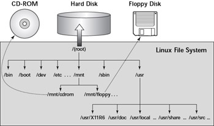

# Sesión 1 - Primeros pasos

**Fecha**: 26/08/2024

## 1. Herramientas

### 1.1. Linux básico

En linux todo es un archivo (directorios, archivos como tal y dispositivos). En linux el sistema de archivos se organiza en una estructura jerárquica a modo de arbol, siendo el nivel más alto del sistema el directorio raíz (`/`) tal y como se muestra en la siguiente figura:

|Comando|Descripción|
|---|---|
|`whatis`|Muestra de manera resumida lo que hace un comando.|
|`man`|Muestra el manual de comandos|
|`pwd`|Imprime la ruta del directorio de trabajo actual|
|`cd`|Cambia el directorio de trabajo actual|
|`ls`|Lista los el contenido (archivos y directorios) del directorio de trabajo actual|
|`clear`|Limpia pantalla|
|`mkdir`|Crea un nuevo directorio|
|`rmdir`|Borrar directorio |
|`cp`|Copia archivos y directorios|
|`rm`|Borra archivos y directorios|
|`mv`|Mueve o renombra archivos|

#### Material de apoyo

> 1. **Linux básico** (material del curso) [[link]](https://udea-so.github.io/udea-so/docs/laboratorio/tutoriales/herramientas/linux)
> 2. **Working with Bash** (MIT) [[link]](https://www.mit.edu/~amidi/teaching/data-science-tools/study-guide/engineering-productivity-tips/#working-with-bash)
> 3. **The Unix and GNU/Linux command line** (Free Electrons) [[link]](unix_linux_introduction.pdf)

#### Reference sheet

> **GNU/Linux most wanted** [[link]](command_memento.pdf)

Este sondeo se realizo entre los estudiantes de la modalidad virtual

|#|Pregunta|Si|No|Total|
|---|---|---|---|---|
|1|¿Ha trabajado antes con un Linux o un SO diferente de Windows?|13|8|21|
|2|¿Ha trabajado con la terminal (no importa el sistema operativo)?|19|2|21|
|3|¿Ha trabajado con el lenguaje C o C++?|0|21|21|
|4|¿Tiene alguna distribución de linux en la máquina en la que hace los trabajos de la universidad?|7|13|21|

* https://www.mit.edu/~amidi/teaching/data-science-tools/tutorial/working-with-git/
* https://bootlin.com/blog/command-line/
* 